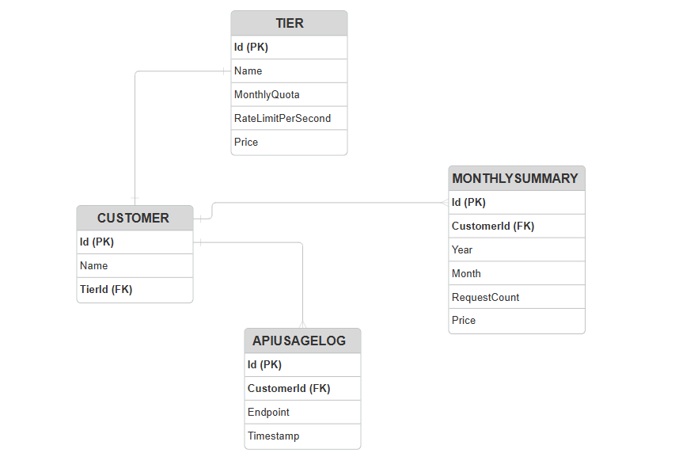
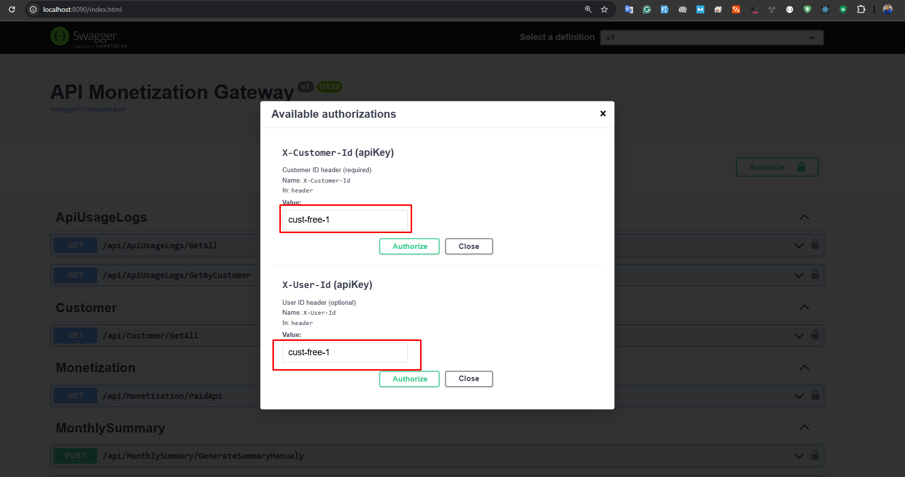
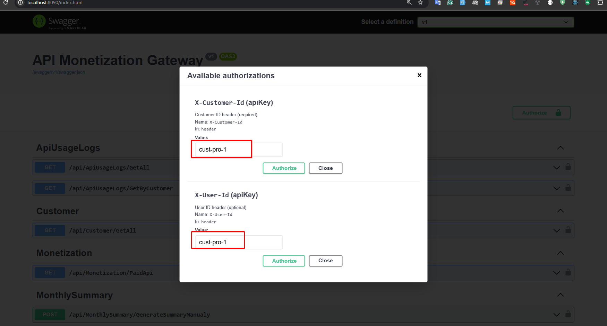

# Note For reviewer
The current version is fully functional and was completed on the same day. There’s still room for improvement if time permits.
At the moment, all endpoints have a rate limit applied. We can improve this by adding a new table to store restricted endpoints and applying limits based on that.


 # 🧩 API Monetization Gateway

This project is a **.NET 8 Web API** that demonstrates how to build an **API Monetization Gateway** —  
a system that controls, tracks, and bills API usage based on customer tiers.

It sits between external API users and internal services to:
- ✅ Authenticate and identify customers  
- ✅ Enforce **rate limits** and **monthly quotas**  
- ✅ Track every API request  
- ✅ Generate **monthly usage summaries**  
- ✅ Expose the entire solution through a **Docker container**

---

## 🧱 Features

| Feature | Description |
|----------|-------------|
| **Tier-based Access** | Supports Free and Pro plans with custom limits |
| **Rate Limiting** | Controls requests per second dynamically |
| **Monthly Quota** | Stops users once monthly request limit is reached |
| **Usage Tracking** | Logs all API calls with timestamp and endpoint |
| **Monthly Summary** | Aggregates usage for each customer automatically |
| **Docker Support** | Build, run, and test easily using Docker |

## 🧱 ERD Diagram


---

## 🐳 Run with Docker

### 1. Pull the image
You can pull the prebuilt image from Docker Hub:
```bash
docker pull saqibhaneef/apimonetizationgateway:latest
````

###	2. Run the container
Map a local port (e.g., 8090) to the container’s internal port (8080):
```bash
docker run -d -p 8090:8080 --name api-gateway saqibhaneef/apimonetizationgateway:latest
````

### 3. Access the API
Swagger UI: http://localhost:8090/
Example API call:



## . Pro Customer

---

| Tier | Monthly Quota          | Rate Limit         | Price     |
| ---- | ---------------------- | ------------------ | --------- |
| Free | 100 requests/month     | 2 requests/second  | $0        |
| Pro  | 100,000 requests/month | 10 requests/second | $50/month |


X-Customer-Id and X-User-Id : cust-free-1   # Free tier
X-Customer-Id and X-User-Id: cust-pro-1    # Pro tier

---

## 🧠 How It Works

Each request goes through a Rate Limit Middleware.
Middleware checks the customer’s tier and rate limit rules.
If within limits → request is logged in the database.
If over limit → returns HTTP 429 (Too Many Requests).
A background worker creates monthly summaries automatically.


## 🧭 System Architecture

The diagram below shows how all components interact:

Flow:
Client → API Gateway → RateLimit Middleware → RateLimitService → Database
↳ MonthlySummaryWorker → Aggregates data and stores summaries.

---

## 🧹 Stop and Remove the Container

If you want to stop and clean up:
docker stop api-gateway
docker rm api-gateway


## Tech Stack

.NET 8 Web API

Entity Framework Core (SQLite)

In-memory caching for rate limiting

Background service for monthly summaries

xUnit for testing

Docker for containerization

## 📦 Local Development (Optional)

You can also run it locally without Docker:

---

### 🧾 Quick Commands Summary

| Action           | Command                                                                                  |
| ---------------- | ---------------------------------------------------------------------------------------- |
| Pull image       | `docker pull saqibhaneef/apimonetizationgateway:latest`                                   |
| Run container    | `docker run -d -p 8090:8080 --name api-gateway saqibhaneef/apimonetizationgateway:latest` |
| Open in browser  | [http://localhost:8090/](http://localhost:8090/)                           |
| Stop container   | `docker stop api-gateway`                                                                |
| Remove container | `docker rm api-gateway`                                                                  |


### ❤️ Author

Muhammad Saqib Hanif
